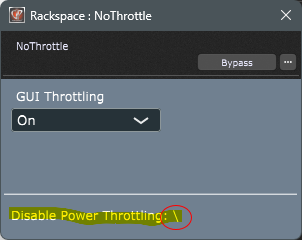

# NoThrottle
## Abstract
The new Intel CPUs have P- and E-cores which have different performance profiles. Windows 11 might schedule the audio thread to an E-core when a the window is hidden, minimized or not visible to the user. This can be prevented by disabling throttling. This plugin takes care of that.

### Details
This plugin disables throttling for the audio thread. To make sure this behavior cannot be overriden by other components, this is re-applied every second. However, for the GUI thread Power throttling is configurable separately and depending on the setting it is also reapplied every second, except for `Skip` (see below) 

### Usage
Just insert the plugin and adjust the `GUI Throttling` parameter (see below). It does not need to process any audio data. When the plugin window is opened, the status line will indicate whether it is active or not by a 'turning' dash:

### Parameters
The plugin only has one parameter, called `GUI Throttling`. It has four possible selections:

1. `On`: Power throttling is switched to on for the Gui thread.
2. `Off`: Power throttling is switched to off for the Gui thread.
3. `Default`: Power throttling is left to the default policy of Windows.
4. `Skip`: The plugin does not interfere with the throttling settings. 

**N.B.**:
* When the `GUI Throttling` is switched from one of the other choices to `Skip`, Power throttling is reset to `Default` first, but after that the setting will no longer applied again (until the setting is switched to one of the other choices). 
* When `GUI Throttling` is set to `On`, `Off` or `Default` the setting is re-applied every second.
* When the plugin is newly inserted, `GUI Throttling` is set to `Skip` *without* applying any Power throttling policy. 
* No policy is applied when a saved project is loaded and the saved setting was `Skip`.
* Power throttling is always switched off for the **audio thread**. This is re-applied every second.
* Bear in mind that the settings are applied to the threads of a running process and persisted as long as that process runs. So to reset all effects of the plugin (especially to the audio thread), the process must be ended and restarted.
